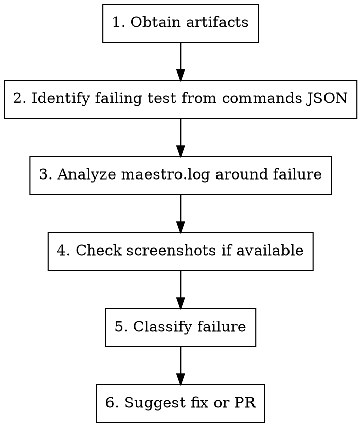

# Diagnose Maestro Test Failure

## Overview

Investigate Maestro test failures using debug artifacts. Classify whether the failure is a test issue, a Maestro framework bug, or an app-side problem, then suggest a fix.

## When to Use

- User shares a GitHub Actions job link with failing Maestro tests
- User points to a local directory containing Maestro debug artifacts
- User asks why a specific test failed in CI

## Input

The user provides one of:

1. **GitHub Actions job link** — e.g. `https://github.com/mobile-dev-inc/Maestro/actions/runs/<run_id>/job/<job_id>`
2. **Local artifact directory** — e.g. `~/Downloads/maestro-root-dir-android/tests/demo_app/passing/`

## Investigation Pipeline



## Step 1: Obtain Artifacts

**From GitHub Actions job link:**

```bash
# Get the failing job and step details
gh run view <run_id> --repo mobile-dev-inc/Maestro --json jobs --jq '.jobs[] | select(.databaseId == <job_id>) | {name, conclusion, steps: [.steps[] | {name, conclusion}]}'

# Download the debug artifacts
gh run download <run_id> --repo mobile-dev-inc/Maestro --name maestro-root-dir-<platform>
```

The artifact structure (with `--flatten-debug-output`) is:

```
maestro-root-dir-<platform>/tests/<app_name>/<test_type>/
  maestro.log
  commands-(<flow_name>).json     # one per flow
  screenshot-<status>-<ts>-(<flow_name>).png  # only for failures/warnings
```

**From local directory:** The user provides the path directly. Verify it contains `commands-*.json` files and `maestro.log`.

## Step 2: Identify Failing Tests from Commands JSON

Each `commands-(flowName).json` contains the list of executed commands with their status and metadata.

```bash
# List all command files
ls artifacts/commands-*.json

# Find which tests have FAILED commands
grep -l '"FAILED"' artifacts/commands-*.json
```

For each failing test, read the commands JSON. The structure is an array of objects:

```json
[
  {
    "command": { /* the MaestroCommand */ },
    "metadata": {
      "status": "COMPLETED" | "FAILED" | "WARNED" | "SKIPPED",
      "timestamp": 1712108142000,
      "duration": 1234,
      "error": { "message": "...", "detailMessage": "..." },
      "sequenceNumber": 0
    }
  }
]
```

Find the command with `"status": "FAILED"` and note:
- Which command failed (tap, assert, scroll, etc.)
- The error message
- The timestamp (needed for log correlation)
- The duration (was it a timeout?)

## Step 3: Analyze maestro.log Around the Failure

The `maestro.log` contains detailed execution logs for ALL flows in the run. Use the failing flow name and timestamp from Step 2 to find the relevant section.

```bash
# Search for the flow name in the log
grep -n "<flow_name>" maestro.log

# Look at lines around the failure timestamp
# The log format is: HH:mm:ss.SSS [LEVEL] logger.method: message
grep -n "FAILED\|ERROR\|Exception\|timeout" maestro.log
```

Key things to look for:
- **Stack traces** — these indicate Maestro framework errors
- **"Element not found"** — the UI element wasn't on screen (test or app issue)
- **"Timeout"** — command didn't complete in time
- **"Connection refused" / "Device not found"** — infrastructure issue
- **Driver errors** — `xctest`, `UIAutomator`, gRPC errors indicate Maestro driver bugs
- **"ADB" errors** — Android device/emulator issues

## Step 4: Check Screenshots

If `screenshot-❌-*-(flowName).png` files exist for the failing flow, read them. They show the screen state at the moment of failure.

This helps determine:
- Was the app in the expected state?
- Was there an unexpected dialog/popup blocking the UI?
- Did the app crash (blank screen)?
- Was the element actually visible but the selector was wrong?

## Step 5: Classify the Failure

Based on Steps 2-4, classify into one of:

### Test Failure (user's flow is wrong)
- **Selector mismatch** — element exists but selector doesn't match (wrong id, text changed)
- **Timing issue** — element appears but flow doesn't wait long enough
- **Flow logic error** — wrong sequence of commands, missing precondition
- **Environment dependency** — test relies on state from a previous test

**Indicators:** Element not found errors, assertion failures on visible elements, screenshot shows expected app state but wrong selector.

### Maestro Framework Bug
- **Driver crash** — xctest runner or UIAutomator driver errors
- **gRPC communication failure** — between CLI and driver
- **Command execution bug** — command does something unexpected
- **Screenshot/hierarchy capture failure** — Maestro can't read the screen

**Indicators:** Stack traces in Maestro code (`maestro.cli.*`, `maestro.drivers.*`, `xctest.*`), gRPC errors, "driver not responding", internal assertion failures.

### App-Side Issue
- **App crash** — app terminated during test
- **App not responding** — ANR or freeze
- **App state issue** — app in unexpected state (not a flow problem, app has a bug)

**Indicators:** Screenshot shows crash dialog or blank screen, logs show "app not running" after launch, `ProcessCrashedException`.

## Step 6: Suggest Fix

Based on classification:

- **Test Failure** → Suggest flow changes (better selectors, `extendedWaitUntil`, retry logic)
- **Maestro Bug** → Identify the likely code area and suggest a PR to the Maestro repo. Search the codebase for the relevant error path.
- **App Issue** → Report the app-side problem, no Maestro change needed

## Common Failure Patterns

| Error in commands JSON | Log pattern | Classification |
|---|---|---|
| `"Element not found"` on tap/assert | `Looking up element... NOT FOUND` | Test (wrong selector) or App (element missing) — check screenshot |
| `"Timeout"` on `waitForElement` | `Timeout waiting for...` | Test (increase timeout) or App (slow load) |
| `null` error but FAILED status | Stack trace with `NullPointerException` | Maestro bug |
| `"App is not running"` | `Process not found` | App crash |
| gRPC / driver errors | `StatusRuntimeException`, `xctest runner` | Maestro bug (driver) |
| `"Assertion failed"` | `Assert condition not met` | Test (wrong assertion) or App (actual bug) |
