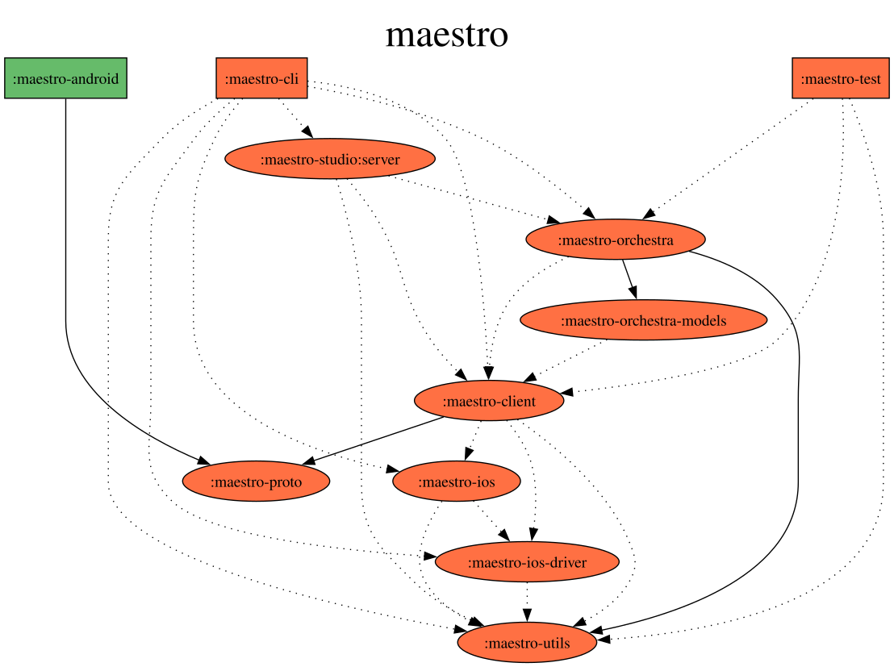

# Contributing to Maestro

Thank you for considering contributing to the project!

We welcome contributions from everyone and generally try to be as accommodating as possible. However, to make sure that your time is well spent, we separate the types of 
contributions in the following types:

- Type A: Simple fixes (bugs, typos) and cleanups
  - You can open a pull request directly, chances are high (though never guaranteed) that it will be merged.
- Type B: Features and major changes (i.e. refactoring)
  - Unless you feel adventurous and wouldn't mind discarding your work in the worst-case scenario, we advise to open an issue or a PR with a suggestion first where you will 
    describe the problem you are trying to solve and the solution you have in mind. This will allow us to discuss the problem and the solution you have in mind.

### Side-note on refactoring

Our opinion on refactorings is generally that of - don't fix it if it isn't broken. Though we acknowledge that there are multiple areas where code could've been structured in a 
cleaner way, we believe there are no massive tech debt issues in the codebase. As each change has a probability of introducing a problem (despite all the test coverage), be 
mindful of that when working on a refactoring and have a strong justification prepared. 

## Lead times

We strive towards having all public PRs reviewed within a week, typically even faster than that. If you believe that your PR requires more urgency, please contact us on a 
public Maestro Slack channel.

Once your PR is merged, it usually takes about a week until it becomes publicly available and included into the next release.

## Developing

### Requirements

Maestro's minimal deployment target is Java 17, and for development, you need to use Java 17 or newer.

If you made changes to the CLI, rebuilt it with `./gradlew :maestro-cli:installDist`. This will generate a startup shell
script in `./maestro-cli/build/install/maestro/bin/maestro`. Use it instead of globally installed `maestro`.

### Debugging

Maestro stores logs for every test run in the following locations:

- CLI Logs: `~/.maestro/tests/*/maestro.log`
- iOS test runner logs: `~/Library/Logs/maestro/xctest_runner_logs`

### Device execution

`maestro test` drives devices through device-core, via the `DeviceCoreDriver` seam in `maestro-orchestra`. The legacy per-platform driver modules (`maestro-android`, `maestro-ios`, `maestro-ios-driver`, `maestro-ios-xctest-runner`, `maestro-web`) and their build scripts have been removed, along with the checked-in driver APKs and iOS driver zips — there's nothing left to build or rebuild locally for a specific platform driver.

## Linting

```bash
./gradlew detekt              # Run detekt code quality checks
./gradlew detektMain          # Run detekt with type resolution
./gradlew detektBaseline      # Generate baseline
```

## Testing

There are 3 ways to test your changes:

- Integration tests
  - Run them via `./gradlew :maestro-test:test` (or from IDE)
  - Cross-module tests that don't require a device (JS engine, flow-control). Device-free tests against the `DeviceCoreDriver` seam itself live in `maestro-orchestra/src/test/` instead, using a fake `DeviceProvider` (`FakeDeviceProvider`).
- Manual testing
  - Run `./maestro` instead of `maestro` to use your local code.
- Unit tests
  - All the other tests in the projects. Run them via `./gradlew test` (or from IDE)

## Module structure

| Module | Purpose |
|--------|---------|
| `maestro-cli` | CLI entry point and user-facing commands |
| `maestro-client` | Host-side SDK: device discovery/provisioning (adb, simctl, locale, etc.) |
| `maestro-orchestra` | Flow execution, YAML parsing, scripting, `DeviceCoreDriver` seam |
| `maestro-orchestra-models` | Command data classes (serializable) |
| `maestro-ai` | AI-powered test capabilities |
| `maestro-test` | Cross-module tests that don't require a device |
| `maestro-utils` | Shared utilities |
| `maestro-proto` | Protocol buffer definitions |
| `e2e` | End-to-end test suites |

### Processing flow

```
YAML Flow File → YamlCommandReader → List<MaestroCommand> → Orchestra.runFlow() → DeviceCoreDriver → Device
```

## Architectural considerations

Keep the following things in mind when working on a PR:

- `Orchestra` class is a layer that translates Maestro commands (represented by `MaestroCommand`) into calls against the `DeviceCoreDriver` interface. There is no `Maestro` facade class anymore — `Orchestra` drives devices directly through that seam.
  - `Orchestra` should remain completely target (Android/iOS/Web) agnostic.
  - Target-specific functionality lives behind `DeviceCoreDriver` (implemented via device-core), not in `Orchestra`.
  - Maestro commands should be as platform-agnostic as possible, though we do allow for exceptions where they are justified.
- Maestro CLI is supposed to be cross-platform (Mac OS, Linux, Windows).
- Maestro is designed to run locally as well as on Maestro Cloud. That means that code should assume that it is running in a sandbox environment and shouldn't call out or spawn 
  arbitrary processes based on user's input
  - For that reason we are not allowing execution of bash scripts from Maestro commands.
  - For that reason, `MaestroCommand` class should be JSON-serializable (and is a reason we haven't moved to `sealed class`)
- Prefer fakes over mocks for driver-level testing (e.g. `FakeDeviceProvider` behind the `DeviceCoreDriver` seam, in `maestro-orchestra/src/test/`). Mocks (MockK) are used in some modules but fakes are the preferred approach.

This graph (generated with [`./gradlew :generateDependencyGraph`][graph_plugin] in [PR #1834][pr_1834]) may be helpful
to visualize relations between subprojects:



## How to

### Add new command

Follow these steps:

- Define a new command in `Commands.kt` file, implementing `Command` interface.
- Add a new field to `MaestroCommand` class, following the example set by other commands.
- Add a new field to `YamlFluentCommand` to map between yaml representation and `MaestroCommand` representation.
- Handle command in `Orchestra` class.
  - If this is a new functionality, you might need to add new methods to the `DeviceCoreDriver` API.
- Add a new test covering the command (e.g. alongside `MaestroCommandTest`, `MaestroCommandSerializationTest`, or `YamlCommandReaderTest` in `maestro-orchestra/src/test/`).

[graph_plugin]: https://github.com/vanniktech/gradle-dependency-graph-generator-plugin
[pr_1834]: https://github.com/mobile-dev-inc/maestro/pull/1834
